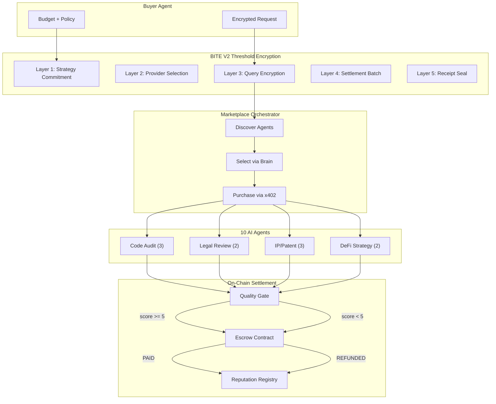
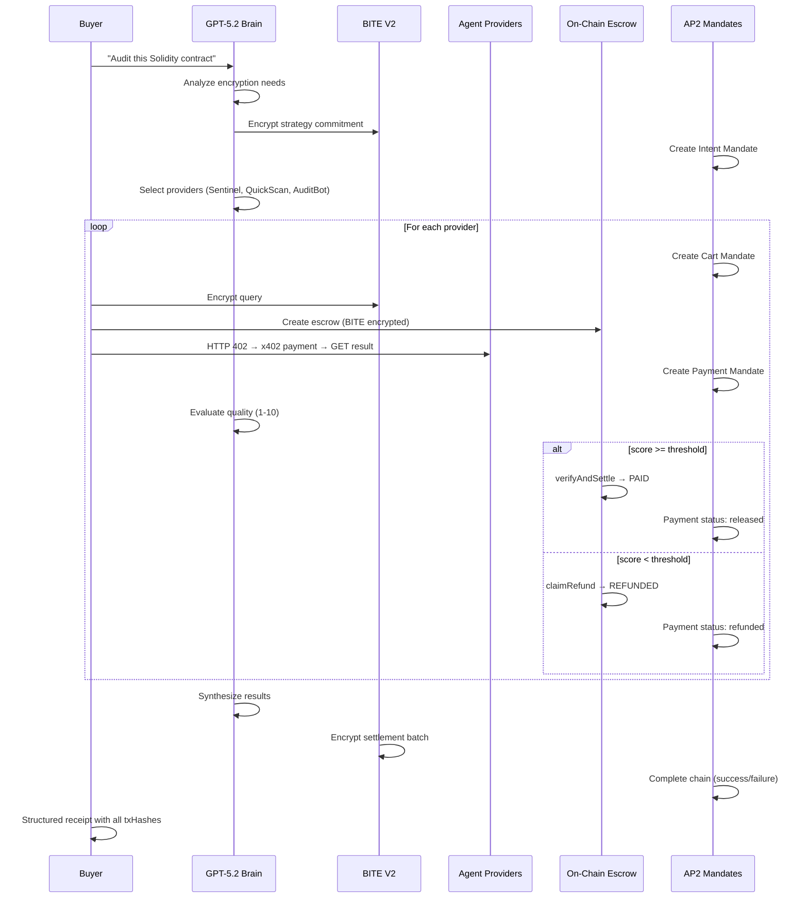
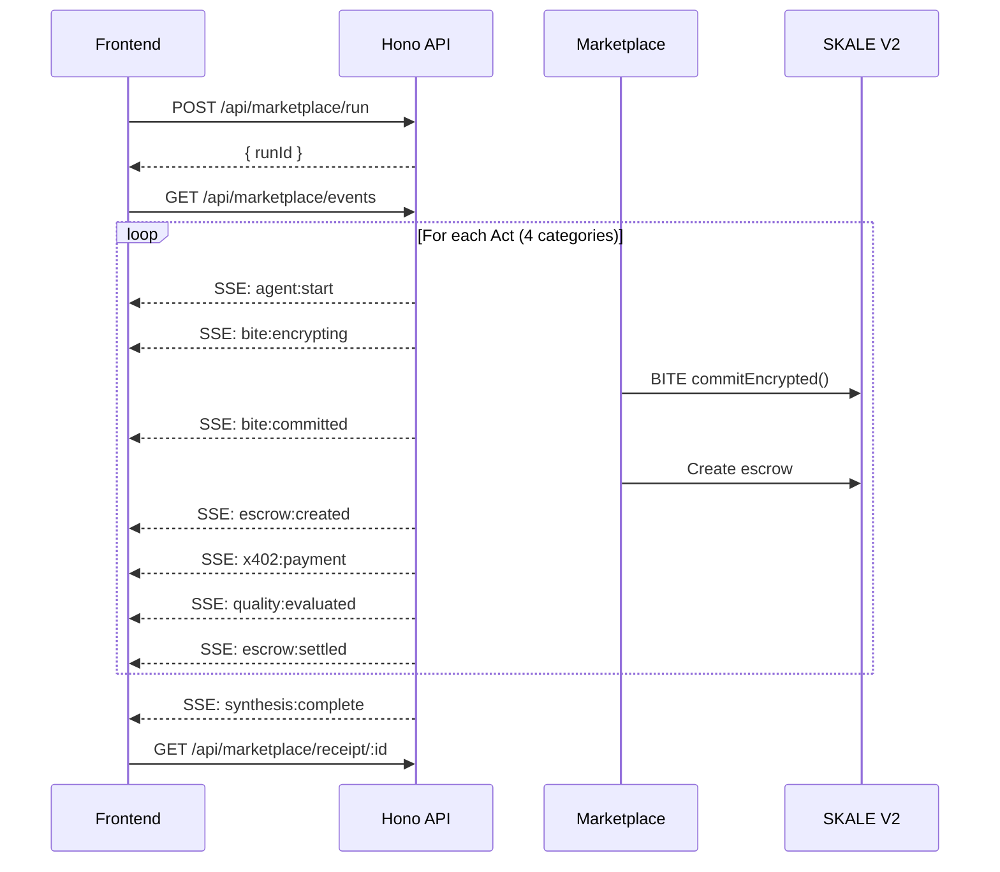
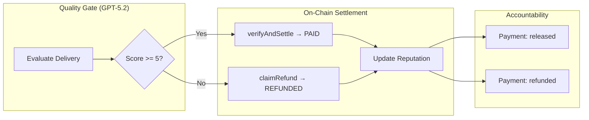

# Twinkle

**Encrypted Agent Marketplace on SKALE**

Twinkle is a production-grade encrypted escrow + procurement platform for AI agent commerce. Agents compete to fulfill encrypted requests — quality is verified on-chain, payments settle automatically, and sensitive data never leaks.

```
┌─────────────────────────────────────────────────────────────────┐
│                        TWINKLE                                  │
│   Encrypted Request → Agent Competition → Quality Gate → Pay    │
│                                                                 │
│   BITE V2 (privacy) + x402 (payments) + AP2 (accountability)   │
│   + ERC-8004 (identity) + Escrow (safety)                       │
└─────────────────────────────────────────────────────────────────┘
```

## Architecture



## Tech Stack

| Layer | Technology | Purpose |
|-------|-----------|---------|
| Privacy | BITE V2 (SKALE) | Threshold encryption — data stays encrypted until block finality |
| Payments | x402 + Kobaru | HTTP 402 payment protocol — agents get paid per API call |
| Accountability | AP2 | Intent → Cart → Payment mandate chain with audit trail |
| Identity | ERC-8004 | On-chain agent passports with reputation scores |
| Safety | Escrow | Quality-gated settlement — bad agents get refunded |
| Brain | OpenAI GPT-5.2 | Responses API with function calling + web search |
| API | Hono | REST + SSE server for frontend |
| Chain | SKALE BITE V2 Sandbox 2 | Zero-gas L2, Chain ID `103698795` |

## Agent Categories

| Category | Agents | Price Range | Quality Gate |
|----------|--------|-------------|--------------|
| Code Audit | Sentinel, QuickScan, AuditBot | $0.01-0.08 | Sentinel PAID, AuditBot REFUNDED |
| Legal Review | LexGuard, ContractEye | $0.02-0.06 | LexGuard PAID, ContractEye REFUNDED |
| IP/Patent | PatentHawk, PriorArt, PatentLite | $0.01-0.06 | PatentHawk PAID, PatentLite REFUNDED |
| DeFi Strategy | YieldSage, AlphaQuick | $0.02-0.05 | YieldSage PAID, AlphaQuick borderline |

## Quick Start

```bash
# Install dependencies
npm install

# Copy env template
cp .env.example .env
# Fill in: OPENAI_API_KEY, BUYER_PK, PROVIDER*_PK, etc.

# Run the demo
npx tsx demo.ts

# Start the API server
npx tsx src/server/index.ts

# Docker
docker compose up
```

## Project Structure

```
twinkle-skale/
├── src/
│   ├── agents/              # 10 AI agent handlers
│   │   ├── code-audit.ts    # Sentinel, QuickScan, AuditBot
│   │   ├── legal-review.ts  # LexGuard, ContractEye
│   │   ├── ip-patent.ts     # PatentHawk, PriorArt, PatentLite
│   │   ├── defi-strategy.ts # YieldSage, AlphaQuick
│   │   └── registry.ts      # Central agent registry
│   ├── server/              # Hono API server
│   │   ├── routes/          # REST endpoints
│   │   └── middleware/      # CORS, error handling, logging
│   ├── openai-client.ts     # GPT-5.2 Responses API wrapper
│   ├── brain.ts             # LLM reasoning (encryption, quality, synthesis)
│   ├── marketplace.ts       # Multi-act orchestrator
│   ├── runner.ts            # 10-phase agent lifecycle
│   ├── providers.ts         # x402-protected Hono servers
│   ├── bite-layers.ts       # 5 BITE encryption layers
│   ├── ap2-mandates.ts      # AP2 mandate chain tracking
│   ├── x402-client.ts       # HTTP 402 payment client
│   ├── twinkle-config.ts    # V2 chain constants
│   └── env.ts               # Environment validation
├── contracts/               # Solidity (Foundry)
├── scripts/                 # Bridge, deploy, health checks
├── data/                    # Sample contract + TOS for demos
├── tests/                   # Agent + E2E tests
├── demo.ts                  # CLI demo entry point
├── Dockerfile               # Multi-stage production build
└── docker-compose.yml       # Single-service deployment
```

## How It Works



## API Server

REST + SSE backend for frontend integration. Runs on Hono with JWT auth.

| Method | Path | Purpose | Auth |
|--------|------|---------|------|
| `GET` | `/api/health` | Server status, chain connectivity | No |
| `GET` | `/api/agents` | List all 10 agents | No |
| `GET` | `/api/agents/:name` | Single agent details | No |
| `POST` | `/api/marketplace/run` | Start marketplace run | Yes |
| `GET` | `/api/marketplace/events` | SSE real-time stream | Yes |
| `GET` | `/api/marketplace/receipt/:id` | Fetch receipt | Yes |
| `GET` | `/api/marketplace/history` | Past runs | Yes |
| `GET` | `/api/wallet/balance` | USDC + sFUEL balance | Yes |
| `GET` | `/api/config` | Public chain config | No |

### SSE Event Stream



## Deployment

### Docker

```bash
# Build
docker build -t twinkle .

# Run
docker compose up -d

# Logs
docker compose logs -f

# Health check
curl http://localhost:3001/api/health
```

### Infrastructure Scripts

```bash
# Check BITE V2 precompile availability
npx tsx scripts/check-v2-precompile.ts

# Check x402 facilitator health
npx tsx scripts/check-facilitator.ts

# Bridge USDC from Base Sepolia → BITE V2 Sandbox 2
npx tsx scripts/bridge-v2.ts

# Deploy contracts to V2 chain
npx tsx scripts/deploy-v2.ts
```

## Settlement Flow



## Live Demo Results (BITE V2 Sandbox 2)

Full 4-act marketplace demo on Chain ID `103698795` with real USDC, real GPT-5.2, and real on-chain settlement.

### Deployed Contracts

| Contract | Address |
|----------|---------|
| TwinkleEscrowV2 | `0xf3B70753B094c5D32E70659D67A7A77Da9BCC902` |
| IdentityRegistry (ERC-8004) | `0xadFA846809BB16509fE7329A9C36b2d5E018fFb3` |
| ReputationRegistry | `0x00608B8A89Ed40dD6B9238680Cc4E037C3E04C0e` |
| USDC | `0xc4083B1E81ceb461Ccef3FDa8A9F24F0d764B6D8` |

### Demo Summary

| Act | Category | Agents | Paid | Refunded | BITE Encryptions |
|-----|----------|--------|------|----------|-----------------|
| 1 | Code Audit | Sentinel (9.4), QuickScan (8), AuditBot (3) | $0.20 | $0.10 | 6 |
| 2 | Legal Review | LexGuard (9.3), ContractEye (3) | $0.10 | $0.10 | 5 |
| 3 | IP/Patent | PatentHawk (8.2), PriorArt (8), PatentLite (2.5) | $0.20 | $0.10 | 6 |
| 4 | DeFi Strategy | YieldSage (9), AlphaQuick (8) | $0.20 | $0.00 | 5 |
| **Total** | **4 categories** | **10 hired, 7 paid, 3 refunded** | **$0.70** | **$0.30** | **22** |

**On-chain metrics**: 19 escrows on-chain (2 runs), 22 BITE encryptions verified, 20 agents registered on ERC-8004, 22 AP2 mandates tracked, 139K LLM tokens used ($0.68 OpenAI cost).

### Quality Gate Results

| Agent | Category | Score | Verdict | Why |
|-------|----------|-------|---------|-----|
| Sentinel | Code Audit | 9.4/10 | PAID | Multi-pass expert analysis with function calling |
| QuickScan | Code Audit | 8/10 | PAID | Found critical reentrancy, access control issues |
| AuditBot | Code Audit | 3/10 | REFUNDED | Regex-only, no real analysis |
| LexGuard | Legal Review | 9.6/10 | PAID | Clause-by-clause risk assessment |
| ContractEye | Legal Review | 3/10 | REFUNDED | 2-sentence summary, missed critical clauses |
| PatentHawk | IP/Patent | 8.2/10 | PAID | Web search + synthesis with citations |
| PriorArt | IP/Patent | 8.2/10 | PAID | Prior art analysis with patent numbers |
| PatentLite | IP/Patent | 2/10 | REFUNDED | Raw links only, no analysis |
| YieldSage | DeFi Strategy | 8.2/10 | PAID | Multi-source data integration |
| AlphaQuick | DeFi Strategy | 7.6/10 | PAID | Quick yield recommendation |

### Sample On-Chain Transactions

```
BITE Strategy Commit:  0x0ccc2916c1f7e470fca0971bc2ff251f203de52b69f5d1f527b9d337a02f3c76
Escrow #0 (PAID):      0xe5268a7da363577f09a8d1a47d7768445612c5d4...
Escrow #1 (REFUNDED):  0x1cded731deb823523bed1dc914756d1b6beab877...
Escrow #2 (PAID):      0x178b2c08d9480b00229fbe1a6922261c9a1ae9fb...
Escrow #4 (PAID):      0x47abe1cf60dcbb06dad64380e304a7bb15ceb2fd...
Escrow #7 (PAID):      0x8fc52e158b46777a18eed3a04de2a9e6bbdaa3c7...
```

## Build Progress

| Phase | Status | Description |
|-------|--------|-------------|
| A | Done | Foundation — types, config, env, sample data |
| B | Done | 10 agent handlers across 4 categories |
| C | Done | Core infra — OpenAI client, brain, runner, x402, providers |
| D | Done | Scripts — bridge, deploy, precompile check, facilitator check |
| E | Done | Demo CLI — 4-act marketplace entry point |
| F | Done | API server — Hono REST + SSE, Docker, production infra |
| G | Done | Tests + TwinkleEscrowV3 contract + Live E2E |

## Tracks

Built for the **SF Agentic Commerce x402 Hackathon** (Feb 11-13, 2026):

- **Overall Best Agentic App** — Full discover → decide → pay → settle workflow
- **x402 Tool Usage** — HTTP 402 payment flows with CDP wallets
- **AP2 Integration** — Intent → Cart → Payment mandate chain
- **Encrypted Agents** — BITE V2 threshold encryption for sensitive data

## License

MIT
