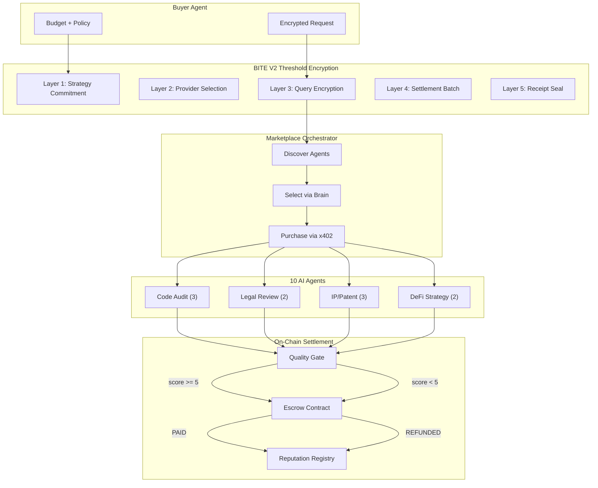
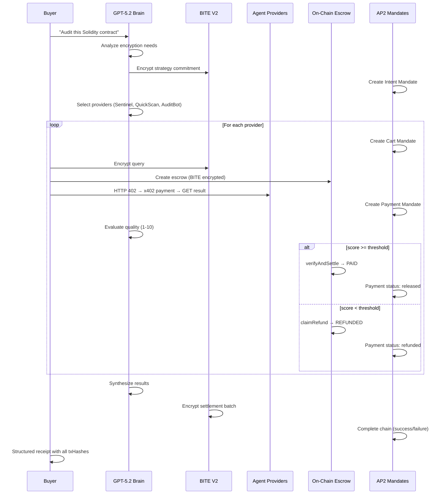

# Twinkle

**Encrypted Agent Marketplace on SKALE**

Twinkle is a production-grade encrypted escrow + procurement platform for AI agent commerce. Agents compete to fulfill encrypted requests — quality is verified on-chain, payments settle automatically, and sensitive data never leaks.

```
┌─────────────────────────────────────────────────────────────────┐
│                        TWINKLE                                  │
│   Encrypted Request → Agent Competition → Quality Gate → Pay    │
│                                                                 │
│   BITE V2 (privacy) + x402 (payments) + AP2 (accountability)   │
│   + ERC-8004 (identity) + Escrow (safety)                       │
└─────────────────────────────────────────────────────────────────┘
```

## Architecture



## Tech Stack

| Layer | Technology | Purpose |
|-------|-----------|---------|
| Privacy | BITE V2 (SKALE) | Threshold encryption — data stays encrypted until block finality |
| Payments | x402 + Kobaru | HTTP 402 payment protocol — agents get paid per API call |
| Accountability | AP2 | Intent → Cart → Payment mandate chain with audit trail |
| Identity | ERC-8004 | On-chain agent passports with reputation scores |
| Safety | Escrow | Quality-gated settlement — bad agents get refunded |
| Brain | OpenAI GPT-5.2 | Responses API with function calling + web search |
| API | Hono | REST + SSE server for frontend |
| Chain | SKALE BITE V2 Sandbox 2 | Zero-gas L2, Chain ID `103698795` |

## Agent Categories

| Category | Agents | Price Range | Quality Gate |
|----------|--------|-------------|--------------|
| Code Audit | Sentinel, QuickScan, AuditBot | $0.01-0.08 | Sentinel PAID, AuditBot REFUNDED |
| Legal Review | LexGuard, ContractEye | $0.02-0.06 | LexGuard PAID, ContractEye REFUNDED |
| IP/Patent | PatentHawk, PriorArt, PatentLite | $0.01-0.06 | PatentHawk PAID, PatentLite REFUNDED |
| DeFi Strategy | YieldSage, AlphaQuick | $0.02-0.05 | YieldSage PAID, AlphaQuick borderline |

## Quick Start

```bash
# Install dependencies
npm install

# Copy env template
cp .env.example .env
# Fill in: OPENAI_API_KEY, BUYER_PK, PROVIDER*_PK, etc.

# Run the demo
npx tsx demo.ts

# Start the API server
npx tsx src/server/index.ts

# Docker
docker compose up
```

## Project Structure

```
twinkle-skale/
├── src/
│   ├── agents/              # 10 AI agent handlers
│   │   ├── code-audit.ts    # Sentinel, QuickScan, AuditBot
│   │   ├── legal-review.ts  # LexGuard, ContractEye
│   │   ├── ip-patent.ts     # PatentHawk, PriorArt, PatentLite
│   │   ├── defi-strategy.ts # YieldSage, AlphaQuick
│   │   └── registry.ts      # Central agent registry
│   ├── server/              # Hono API server
│   │   ├── routes/          # REST endpoints
│   │   └── middleware/      # CORS, error handling, logging
│   ├── openai-client.ts     # GPT-5.2 Responses API wrapper
│   ├── brain.ts             # LLM reasoning (encryption, quality, synthesis)
│   ├── marketplace.ts       # Multi-act orchestrator
│   ├── runner.ts            # 10-phase agent lifecycle
│   ├── providers.ts         # x402-protected Hono servers
│   ├── bite-layers.ts       # 5 BITE encryption layers
│   ├── ap2-mandates.ts      # AP2 mandate chain tracking
│   ├── x402-client.ts       # HTTP 402 payment client
│   ├── twinkle-config.ts    # V2 chain constants
│   └── env.ts               # Environment validation
├── contracts/               # Solidity (Foundry)
├── scripts/                 # Bridge, deploy, health checks
├── data/                    # Sample contract + TOS for demos
├── tests/                   # Agent + E2E tests
├── demo.ts                  # CLI demo entry point
├── Dockerfile               # Multi-stage production build
└── docker-compose.yml       # Single-service deployment
```

## How It Works



## Tracks

Built for the **SF Agentic Commerce x402 Hackathon** (Feb 11-13, 2026):

- **Overall Best Agentic App** — Full discover → decide → pay → settle workflow
- **x402 Tool Usage** — HTTP 402 payment flows with CDP wallets
- **AP2 Integration** — Intent → Cart → Payment mandate chain
- **Encrypted Agents** — BITE V2 threshold encryption for sensitive data

## License

MIT
